**Project Title: n8n LinkedIn Auto-Poster with AI-driven Content & Image Selection**


**Overview** This repository contains an automated n8n workflow that creates and publishes LinkedIn posts on a scheduled basis using AI agents. It generates content, searches (or generates) suitable images, logs post details in Google Sheets, and sends Telegram notifications at key steps. If manual image review is skipped, posts are still published without images to maintain consistency.


---


## 🚀 Features

* **AI-driven Content Generation**: Uses OpenAI’s Chat Model via LangChain nodes to create engaging LinkedIn content.
* **Conditional Image Selection**: Either prompts AI to search/generate an image URL or allows manual search.
* **Google Sheets Integration**: Logs the date, image URL, and post status in a Google Sheet.
* **Telegram Notifications**: Sends updates at each major stage (content ready, saved to sheet, posted).
* **LinkedIn Posting**: Automatically creates LinkedIn posts with or without an image based on availability.
* **Scheduling & Retry**: Runs on a cron-like schedule at 11:00 AM daily with retry logic for HTTP requests.
* **Fault Tolerance**: Continues workflow even if image fetching fails, ensuring posts go out on time.

---

## 📦 Architecture & Workflow

```mermaid
flowchart LR
  subgraph Schedule Trigger
    A[Schedule Trigger @ 11:00 AM] --> B[AI Agent: Content]
  end

  B --> C[Append Row to Google Sheets]
  C --> D[Wait Node]
  D --> E[Retrieve Latest Row]
  E --> F[HTTP Request: Fetch Image]
  F --> G{Image Available?}
  G -- Yes --> H[Create LinkedIn Post with Image]
  G -- No --> I[Create LinkedIn Post without Image]
  H --> J[Update Row: ✅ Posted]
  I --> J
  J --> K[Telegram: Content posted!]

  subgraph Notifications
    B --> L[Telegram: Content Generated]
    C --> M[Telegram: Saved to Sheets]
  end
```



---

## 🛠️ Prerequisites

* **n8n**: Self-hosted or cloud instance
* **OpenAI API Key** (for Chat models)
* **Telegram Bot Token**
* **Google Service Account** with Sheets API enabled and credentials JSON
* **LinkedIn OAuth2 App** credentials
* **LangChain n8n Nodes** installed (`@n8n/nodes-langchain`)

---

## 🔧 Installation & Setup

1. **Clone this repo**:

   ```bash
   git clone https://github.com/dev34250/n8n-LinkedIn.git
   cd n8n-LinkedIn
   ```
2. **Import Workflow**:

   * Log in to your n8n instance.
   * Go to **Workflows → Import from File** and upload `linkedin-auto-poster.json`.
3. **Install Required Nodes** (if not already):

   ```bash
   npm install @n8n/nodes-langchain
   ```
4. **Add Credentials**:

   * **OpenAI**: Paste your API key under Credentials > OpenAI
   * **Telegram**: Add your Bot Token
   * **Google Sheets**: Upload your Service Account JSON and share the sheet
   * **LinkedIn**: Configure OAuth2 App (Client ID & Secret)

---

## ⚙️ Configuration

Edit the following n8n nodes with your custom prompts and IDs:

* **Agent (Content)**: Your main prompt for generating LinkedIn copy.
* **AI Agent (Image)**: Prompt for searching/generating image based on the content.
* **Schedule Trigger**: Adjust the daily posting time if needed.
* **Google Sheets Nodes**: Set your Sheet URL and Sheet ID.
* **Telegram Nodes**: Use your chat ID for notifications.
* **LinkedIn Nodes**: Set your `person` URN (e.g., `TL70CRNMhK`).

---

## 💡 Usage

* Once configured, the workflow will run automatically every day at 11:00 AM.
* Monitor runs in the n8n UI. Logs will indicate any HTTP or API errors.
* Check your Google Sheet to view recorded posts and statuses.
* Telegram messages will notify you:

  1. When content is generated
  2. When content is saved to Sheets
  3. When the post is published on LinkedIn

---

## 🔍 Node Breakdown

| Node Name                      | Function                                               |
| ------------------------------ | ------------------------------------------------------ |
| Schedule Trigger               | Fires workflow at scheduled time (11:00 AM daily)      |
| Agent                          | LangChain AI agent for generating post content         |
| OpenAI Chat Model              | Executes content-generation prompt via OpenAI          |
| Append Row in Sheet            | Saves date & placeholder row to Google Sheets          |
| Wait                           | Allows Sheets to process before retrieval              |
| Get Row(s) in Sheet            | Retrieves all rows; code then filters for the latest   |
| Code1                          | JavaScript selects the newest row                      |
| HTTP Request (Node B)          | Fetches image from provided URL                        |
| If                             | Checks for HTTP errors to determine image availability |
| Create a post / Create a post2 | Posts to LinkedIn with or without image                |
| Update Row in Sheet            | Marks the `Posted` column as ✅                         |
| Send a text message\*          | Telegram notifications at various stages               |

---

## 🐞 Troubleshooting

* **OAuth errors**: Re-authenticate credentials in n8n, ensure scopes are correct.
* **Sheet not found**: Verify the Google Sheet URL and that the service account has edit access.
* **LinkedIn failures**: Confirm your OAuth2 App credentials and URN format.
* **Image fetch errors**: Check that the URL returned by the AI agent is publicly accessible.
* **Workflow stops**: Inspect n8n Execution Logs for stack traces and retry failed nodes manually.

---

## 🤝 Contributing

Contributions are welcome! Feel free to open issues or submit pull requests. Please adhere to the following:

1. Fork the repository.
2. Create a feature branch (`git checkout -b feature/YourFeature`).
3. Commit your changes (`git commit -m "Add YourFeature"`).
4. Push to branch (`git push origin feature/YourFeature`).
5. Open a Pull Request.

---

## 📄 License

This project is licensed under the [MIT License](LICENSE).

---

## ✉️ Contact

* **Maintainer**: YOUR NAME HERE
* **Email**: dev34250@gmail.com(mailto:dev34250@gmail.com)
* **LinkedIn**: [DEV SHARMA](https://www.linkedin.com/in/devsharma2004/)
